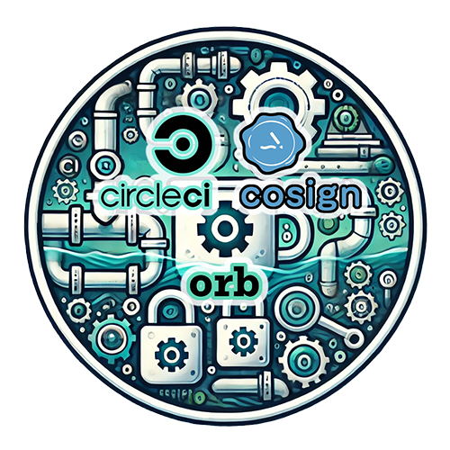

<div align="center">
  
  <h1>CircleCI Cosign Orb</h1>
  <i>An orb for simplifying Cosign installation and use within CircleCI.</i><br /><br />
</div>

[](https://circleci.com/gh/juburr/cosign-orb) [](https://circleci.com/developer/orbs/orb/juburr/cosign-orb) [](https://raw.githubusercontent.com/juburr/cosign-orb/master/LICENSE) [](https://discuss.circleci.com/c/ecosystem/orbs)

This is an unofficial Cosign orb for installing Cosign in your CircleCI pipeline. Use it to sign container images and verify signatures.

This orb is primarily intended for use by private organizations at this time. Notice that the convenience commands provided in the initial version of this orb don't attempt to use keyless signing, upload to transparency logs, etc. They assume a simple setup with a public/private key pair stored as base64 encoded secrets within a CircleCI context. If advanced features are needed, you can use this orb for installation only and then run the cosign binary with your own arguments. Contributions are welcome!

## Features
### **Secure By Design**
- **Least Privilege**: Installs to a user-owned directory by default, with no `sudo` usage anywhere in this orb.
- **Integrity**: Checksum validation of all downloaded binaries using SHA-512.
- **Provenance**: Installs directly from Cosign's official [releases page](https://github.com/sigstore/cosign/releases/) on GitHub. No third-party websites, domains, or proxies are used.
- **Confidentiality**: All secrets and environment variables are handled in accordance with CircleCI's [security recommendations](https://circleci.com/docs/security-recommendations/) and [best practices](https://circleci.com/docs/orbs-best-practices/).
- **Privacy**: No usage data of any kind is collected or shipped back to the orb developer.

Info for security teams:
- Required external access to allow, if running a locked down, self-hosted CircleCI pipeline on-prem:
  - `github.com`: For download and installation of the Cosign tool using HTTPS.

## Usage

### Installation

Use the `cosign-orb` to handle installation of Cosign within your CircleCI pipeline without needing to create a custom base image. After installation, you can then use the `cosign` command anywhere within your job. Caching is supported if you want to prevent re-downloading Cosign on successive runs of your pipeline, though the download and installation are normally extremely fast.


```yaml
version: 2.1

orbs:
  cosign: juburr/cosign-orb@0.6.3

parameters:
  cimg_base_version:
    type: string
    default: "current-22.04"
  cosign_version:
    type: string
    default: "2.5.0"

jobs:
  sign_container:
    docker:
      - image: cimg/base:<< pipeline.parameters.cimg_base_version >>
    steps:
      - checkout
      - cosign/install:
          caching: true
          verify_checksums: strict
          version: << pipeline.parameters.cosign_version >>
      - run:
          name: Run Custom Cosign Commands
          command: |
            # Use the cosign binary however you'd like here...
            cosign version
```

